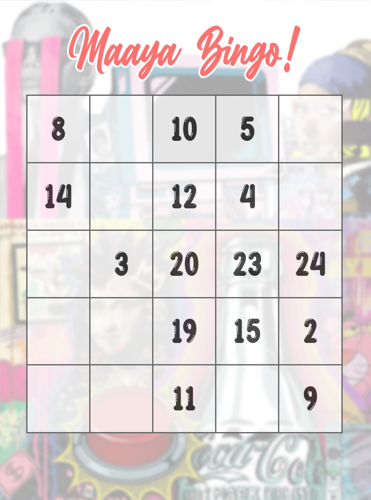

# Custom Bingo Card Generator

This project is a custom bingo card generator implemented using HTML, CSS, and JavaScript. The project allows you to dynamically generate bingo cards with a custom logo, custom text and background image. A Flask server is used to capture screenshots of the generated bingo cards.
<br><br>


## Getting Started

### Installation

Install the required Python packages using the following command:

```
pip install Flask
```
```
pip install pyscreenshot
```

### Run the program
To run the project, follow the instructions below:

1. Open the browser window and run `main.py`. Ensure that the browser is in full-screen mode.
2. If the images are not cropped properly, adjust the crop values in `main.py`.

## Flask Server for Screenshots

The Flask server captures screenshots of the bingo cards using the `pyscreenshot` library. The server saves the screenshots in the "bingo-cards" directory.

## Notes

- Ensure that the browser window is in full-screen mode for proper card generation.
- Adjust the crop values in main.py if the images are not cropped correctly.
- The server captures up to 100 screenshots before exiting. Update the condition in the Flask app as needed.
- Open the browser window and run main.py. Make sure it is full screen. Change the crop values of main.py if images are not cropped properly.
